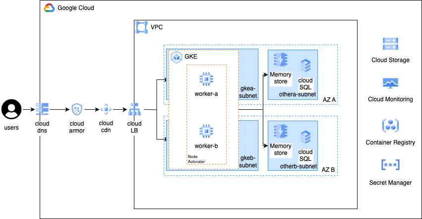
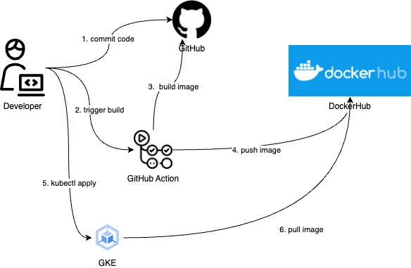
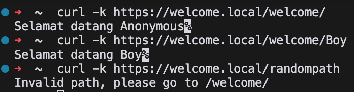
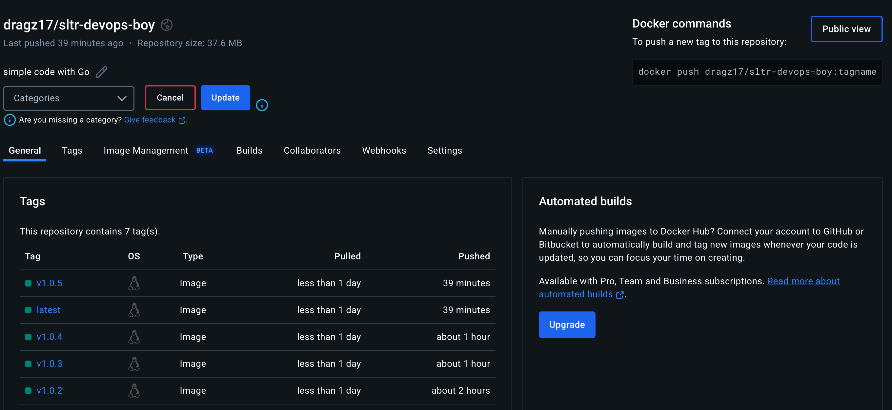
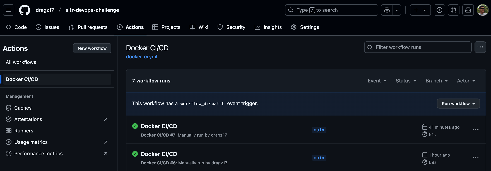
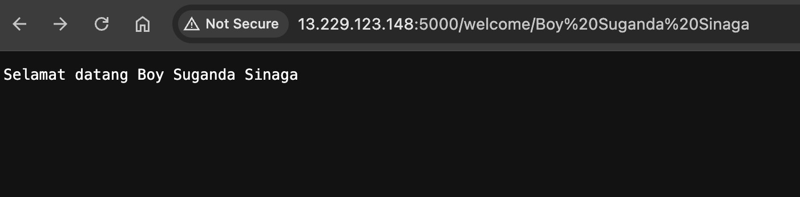

# High-Level Architecture

## Overview
This project is designed to deploy a simple web application in a cloud environment using Google Cloud Platform (GCP).

## Architecture Components

### Networking & Security
- **VPC (Virtual Private Cloud)** – Provides network segmentation and isolates different workloads.
- **Cloud Load Balancer (LB)** – Distributes incoming traffic to backend services running in GKE.
- **Cloud Armor** – Implements Web Application Firewall (WAF) to protect against DDoS and other attacks.
- **Cloud DNS** – Manages domain resolution for applications.
- **Cloud CDN** – Caches content closer to users to reduce latency and improve performance.

### Compute & Scaling
- **Google Kubernetes Engine (GKE)** – Manages containerized workloads with automatic scaling.
- **Node Autoscaler** – Ensures that worker nodes automatically scale based on resource demands.
- **GKE Workers (worker-a & worker-b)** – Runs containerized applications across different availability zones for high availability.

### Data & Storage
- **Memory Store** – Provides in-memory caching for fast data retrieval. *(if needed in the future)*
- **Cloud SQL** – Fully managed relational database service for application data storage. *(if needed in the future)*

### Observability & Security
- **Cloud Monitoring & Logging** – Ensures system health observability with real-time metrics and logs.
- **Secret Manager** – Securely stores and manages sensitive credentials such as API keys, database passwords, and certificates. *(if needed in the future)*
- **Container Registry** – Stores and manages container images before deployment to GKE.

---

# CI/CD Pipeline

## Workflow
1. **Code Push**: Developers push code to the GitHub repository.
2. **GitHub Actions**: Triggers the CI/CD pipeline.
3. **Build Process**:
   - Builds the Docker image.
   - Tags the image with `latest` and release version.
   - Pushes the image to a public Docker registry.
4. **Kubernetes Deployment**:
   - Updates the deployment manifest.
   - Applies the new deployment to GKE using `kubectl`.
5. **Verification**:
   - Access the application.
   - Checks the health of the deployed application.

---

# Evidence

## Application Access

- URL: `http(s)://<IP>/welcome/{name}`
- API Endpoints:
  - `/welcome/{name}`: Returns `"Selamat datang {name}"` if name is provided; otherwise, returns `"Anonymous"`.

## Containerization
- Docker Build: `docker build -t testing/welcome .`
- Docker Run: `docker run -d -p 5000:5000 --name welcome-container testing/welcome`
- Docker Compose: `docker-compose up -d`

## Container Registry

- DockerHub: `dragz17/sltr-devops-boy`

## GitHub Actions

- URL: `https://github.com/dragz17/sltr-devops-challenge/actions/workflows/docker-ci.yml`

- Deployment to VM: `http://13.229.123.148:5000/`

## Orchestration
- Please refer to [this  link](./k8s/README.md)
- Using Minikube in Local

---

# Conclusion
This document outlines the high-level architecture, CI/CD pipeline, and deployment evidence for the application.
